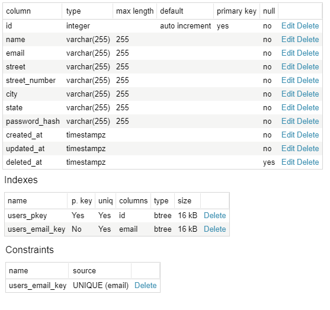
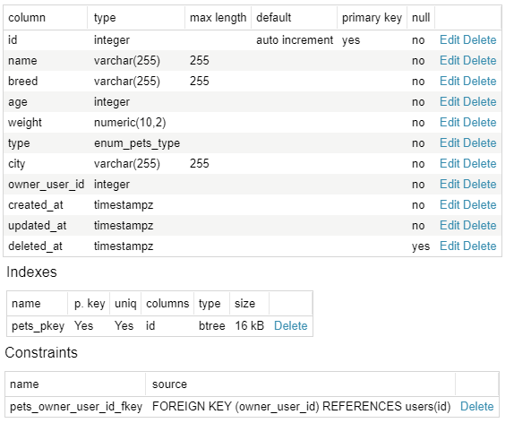

# Pet Finder
> REST API para projeto de adoção de animais de estimação.

Este software, é a API de um projeto pessoal para a adoção de animais abandonados.

## Development setup

Instale as dependências do Projeto

```sh
yarn install
```

Renomei o arquivo .env.example para .env e configure as variáveis de segurança e de banco de dados

```sh
APP_SECRET=HASH_MD5

# DATABASE
DB_NAME=DATABASE_NAME
DB_USERNAME=DATABASE_USER
DB_PASSWORD=DATABASE_PASSWORD
DB_HOST=DATABASE_HOST
```


Rode as migrations

```sh
yarn sequelize db:migrations
```

Inicie o servidor

```sh
yarn dev
```

## Database Schemas

**Users Schema**



**Pets Schema**


